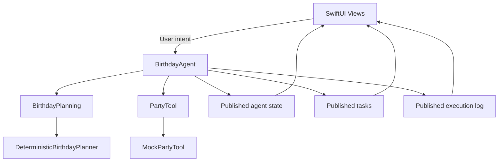
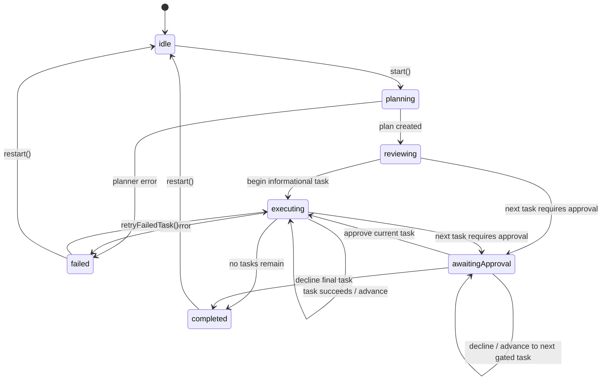

# BirthdayPartyPilot

```text
SwiftUI Views
      ↓ user intent
BirthdayAgent
      ├── BirthdayPlanning
      │      └── DeterministicBirthdayPlanner
      └── PartyTool
             └── MockPartyTool
      ↓
Observable state + execution logs
```

BirthdayPartyPilot is a SwiftUI demonstration of a safe, approval-driven
birthday-planning agent. The app shows how an agent can turn a goal into an
ordered plan, execute informational work, pause at side-effect boundaries,
recover from a deterministic failure, and expose its progress to a UI.

## What BirthdayPartyPilot demonstrates

- Converting a structured party context into an ordered task plan
- Explicit agent states instead of loosely related Boolean flags
- Sequential asynchronous task execution
- Approval gates for side-effecting tasks
- Deterministic failure and same-task retry
- Declining an approval-required task without executing it
- Clean restart from completed and failed terminal states
- Observable progress and execution logs in SwiftUI
- Dependency injection through planner and tool protocols

The current deterministic plan contains six tasks:

1. Calculate cake servings
2. Create food quantity checklist
3. Prepare party-favor shopping list
4. Confirm venue reservation details
5. Draft RSVP reminder
6. Prepare cake pickup reminder

The first three tasks are informational. The final three require approval.

## Why the planner is deterministic

`DeterministicBirthdayPlanner` returns a fixed task sequence behind the
`BirthdayPlanning` protocol. This makes planning, approvals, execution,
failure, retry, decline, and restart behavior repeatable in tests.

Determinism is useful here because it:

- removes model variability from state-machine tests,
- gives every task a fresh UUID on each plan,
- makes task ordering and approval requirements explicit,
- allows failures and retries to be reproduced reliably, and
- establishes a stable baseline for a future LLM planner.

The deterministic planner is an implementation detail, not an architectural
constraint. The agent depends only on `BirthdayPlanning`.

## Architecture



### Main responsibilities

- **SwiftUI views** render state and send user intent to the agent.
- **BirthdayAgent** owns planning, approval, execution, retry, decline, and
  restart behavior.
- **BirthdayPlanning** abstracts plan creation.
- **PartyTool** abstracts task execution.
- **PartyTask** carries identity, category, approval requirements, and status.
- **Execution logs** provide a readable history of transitions and outcomes.

Views remain declarative. They do not decide which task runs next or bypass
approval checks.

## Agent state flow



The retry operation uses the existing `executing(taskID)` state. There is no
separate retrying state. Invalid operations are ignored when the current state
does not permit them.

## Approval and safety boundary

Each `PartyTask` declares an `ApprovalRequirement`:

- `.none` tasks may execute automatically.
- `.required` tasks pause in `.awaitingApproval(taskID)`.

Before a required task reaches `PartyTool`, the agent verifies that its task ID
has been approved. Approval and decline actions must match the exact task
currently awaiting approval.

Declining a task:

1. marks that task `.declined`,
2. records the decision in the execution log,
3. does not add the task ID to the approved set,
4. does not pass the task to `PartyTool`, and
5. advances normal sequential execution.

The project performs no real purchases, messages, calendar actions, networking,
or persistence.

## Failure, retry, cancellation, and restart

### Failure

`MockPartyTool` intentionally fails the first execution attempt for
`Prepare party-favor shopping list` for each task UUID. The agent marks the
task failed, records the error, enters `.failed`, and stops execution. Later
tasks remain pending.

### Retry

`retryFailedTask()` is valid only when the agent is failed and the recorded
task still has failed status. It:

1. reuses the same task UUID,
2. marks only that task running,
3. invokes the existing tool,
4. marks the task completed on success, and
5. resumes execution from the next task.

Completed tasks are not rerun, the planner is not called again, approvals are
preserved, and existing logs are retained.

### Cancellation

Cancellation is intentionally not implemented in the current increment.
`PartyTaskStatus` reserves a `.cancelled` status, but there is no cancellation
operation or asynchronous cancellation mechanism in `BirthdayAgent`.

### Restart

`restart()` is valid only from `.completed` or `.failed`. It clears tasks,
approvals, logs, failure information, and execution indices, then returns the
agent to `.idle`. It preserves `PartyContext` and the injected planner and tool.
A later `start()` creates a fresh plan with new task UUIDs.

## AI-assisted development workflow

Repository-level instructions in `AGENTS.md`, `.cursor/rules`, and
`docs/decisions.md` establish persistent boundaries for AI-assisted work:

1. inspect relevant implementation and tests,
2. explain the proposed change,
3. identify files that will change,
4. implement the smallest complete increment,
5. add focused deterministic tests,
6. build and run relevant tests,
7. review the final diff, and
8. report verified results and uncertainty.

The venue-task prompt comparison is documented in
[`docs/workflow-experiments.md`](docs/workflow-experiments.md). It compares a
vague prompt with a constrained prompt and shows how explicit ordering and
verification requirements reduce manual clarification.

## XcodeBuildMCP verification process

Apple-platform verification uses XcodeBuildMCP rather than raw `xcodebuild`,
`xcrun`, or `simctl` commands.

The normal verification sequence is:

1. Use `session_show_defaults` to verify the project, scheme, and simulator.
2. Set defaults when needed:
   - project: `BirthdayPartyPilot.xcodeproj`
   - scheme: `BirthdayPartyPilot`
   - simulator: iPhone 17
3. Run focused tests with `test_sim` and `-only-testing` arguments.
4. Run the complete unit or unit/UI suite with `test_sim`.
5. Compile with `build_sim`.
6. Use `build_run_sim` when runtime or manual UI verification is required.
7. Report test counts, failures, warnings, and build errors without hiding
   them.

The latest documented feature verification used an iPhone 17 simulator and
completed 28 unit/UI tests successfully.

## How to build and run

### Xcode

1. Open `BirthdayPartyPilot.xcodeproj`.
2. Select the `BirthdayPartyPilot` scheme.
3. Select an iPhone simulator, such as iPhone 17.
4. Press **Command-R** to build and run.
5. Press **Command-U** to run tests.

### Demo flow

1. Select **Create Birthday Plan**.
2. Review the six generated tasks.
3. Select **Start Plan Execution**.
4. Observe the deterministic favor-task failure.
5. Select **Retry Failed Task**.
6. Approve or decline each approval-required task.
7. Complete the plan.
8. Select **Restart Demo** to return to the initial party brief.

## Future LLM planner extension

A future LLM-backed planner can conform to `BirthdayPlanning`:

```swift
struct LLMBirthdayPlanner: BirthdayPlanning {
    func createPlan(for context: PartyContext) async throws -> [PartyTask] {
        // Convert model output into validated PartyTask values.
    }
}
```

It can then be injected into `BirthdayAgent` without changing the execution
state machine, tool protocol, or SwiftUI views.

An LLM planner should still be constrained by the same safety contract:

- produce validated task categories and approval requirements,
- assign side-effecting tasks `.required`,
- return stable task identities for the duration of a run,
- never invoke tools directly,
- preserve deterministic tests for agent execution behavior, and
- keep real networking or persistence behind separately reviewed boundaries.
